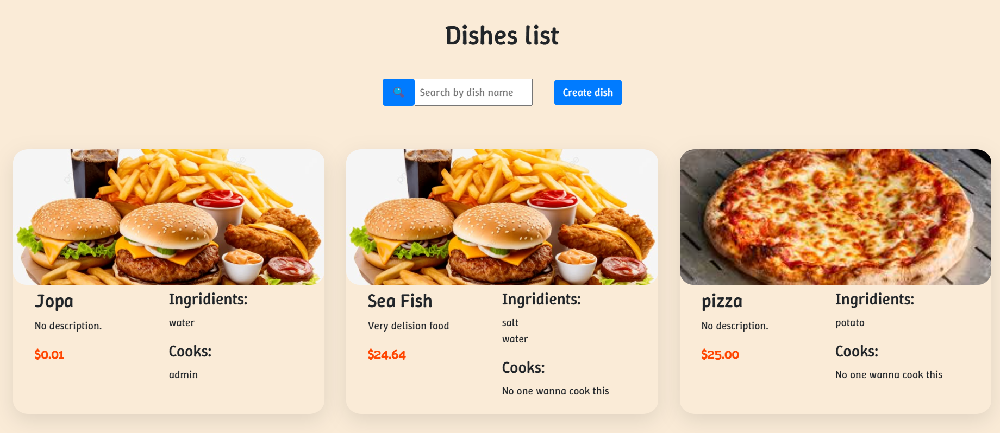
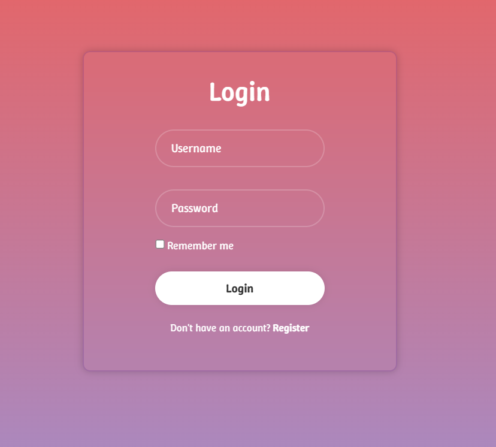

## Kitchen Service

Django project for Help You manage your Kitchen

## Check it Out

[https://kitchen-service-deploy.onrender.com/](https://kitchen-service-deploy.onrender.com/)

## Installation

Python3 must be installed

```shell
git clone https://github.com/Leo9siy/kitchen_service.git
cd kitchen_service
python -m venv .venv
.venv/Scripts/activate
pip install -r requirements.txt
python manage.py sunserver #Starts Django Project
```

## Features

* Different permission for Cooker and Admin
* Access to make a order
* Changing password but Email

## Demo






